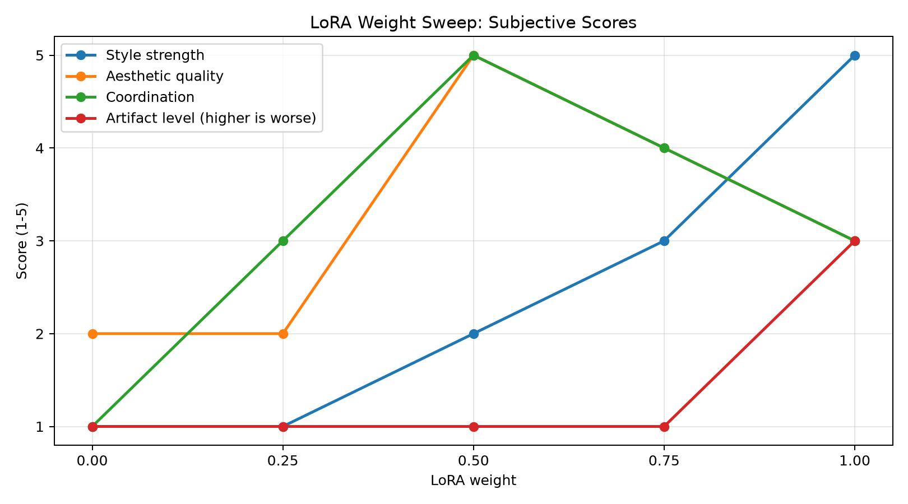

# Experiment 001: LoRA Weight Sweep

## Question

在固定 checkpoint、prompt、seed 和采样参数时，
LoRA 权重的变化会怎样影响生成结果？

我主要观察：

- 风格表现
- 人物结构
- 图像细节
- 伪影或过拟合痕迹

我考虑的目标lora是一个极富盛名的传奇lora——CunnyFunky

我将实验该lora在一张特定图里权重不同导致的变化

因此该实验实用意义并不高，仅作练习

## Hypothesis

我合理预测：

- 较低权重时，LoRA 风格不明显；
- 中等权重可能在风格与结构之间更平衡；
- 较高权重可能增强风格，也可能带来结构异常或细节粘连。

## Controlled Variables

- Checkpoint: chenkinNoobXLCKXL_v02
- 固定LoRA:
  - < lora:馨染_Wan21-14B-720P:0.5 >
  - < lora:幻月重光_暖色滤镜_0.1:0.5 >
  - < lora:踏纷:0.6 >
  - < lora:20250514-1747231472827:0.4 >
  - < lora:VOGUE_Fashion_Magazine_Cover_Vintage_1960-1975_SDXL:2 >
  - tips：部分lora的output name实在奇怪，想复现可以用hash精准寻找
- 待测LORA:
  - < lora:CunnyFunkyXLillokrV6311P >
- Prompt: 
  - ```textile
    (vogue:2),1girl,solo,long hair,looking at viewer,bangs,blue eyes,hair ornament,dress,bare shoulders,jewelry,blue hair,upper body,ahoge,white hair,multicolored hair,earrings,detached sleeves,looking back,from behind,white dress,arm up,streaked hair,petals,veil,backless outfit,backless dress,Furina,depth of field,light particles,lens flare,(artist:quasarcake:0.6),extreme aesthetic,(wlop:0.6),wanke,rella,wanke,masterpiece,best quality,good quality,newest,year 2024,year 2023,very aesthetic,absurdres,Visual impact,A shot with tension,ultra-high resolution,32K UHD,sharp focus,best quality,masterpiece,Emotionalization masterpiece,unconventional supreme,masterful details,with a high end texture,in the style of fashion photography,(Visual impact:1.2),giving the poster a dynamic and visually striking appearance,impactful picture,offcial art,colorful,splash of color,movie perspective,masterpiece,best quality,amazing quality,very aesthetic,absurdres,best quality,newest
    ```
- Negative prompt: 
  - ```textile
    multiple_breasts,(mutated_hands_and_fingers:1.5_),(long_body_:1.3),(mutation,poorly_drawn_:1.2)_,black white,bad_anatomy,liquid_body,liquid_tongue,disfigured,malformed,mutated,anatomical_nonsense,text_font_ui,error,malformed_hands,long_neck,blurred,lowers,lowres,bad_anatomy,bad_proportions,bad_shadow,uncoordinated_body,unnatural_body,fused_breasts,bad_breasts,huge_breasts,poorly_drawn_breasts,extra_breasts,liquid_breasts,heavy_breasts,missing_breasts,huge_haunch,huge_thighs,huge_calf,bad_hands,fused_hand,missing_hand,disappearing_arms,disappearing_thigh,disappearing_calf,disappearing_legs,fused_ears,bad_ears,poorly_drawn_ears,extra_ears,liquid_ears,heavy_ears,missing_ears,fused_animal_ears,bad_animal_ears,poorly_drawn_animal_ears,extra_animal_ears,liquid_animal_ears,heavy_animal_ears,missing_animal_ears,text,ui,error,missing_fingers,missing_limb,fused_fingers,one_hand_with_more_than_5_fingers,one_hand_with_less_than_5_fingers,one_hand_with_more_than_5_digit,one_hand_with_less_than_5_digit,extra_digit,fewer_digits,fused_digit,missing_digit,bad_digit,liquid_digit,colorful_tongue,black_tongue,cropped,watermark,username,blurry,JPEG_artifacts,signature,3D,3D_game,3D_game_scene,3D_character,malformed_feet,extra_feet,bad_feet,poorly_drawn_feet,fused_feet,missing_feet,extra_shoes,bad_shoes,fused_shoes,more_than_two_shoes,poorly_drawn_shoes,bad_gloves,poorly_drawn_gloves,fused_gloves,bad_cum,poorly_drawn_cum,fused_cum,bad_hairs,poorly_drawn_hairs,fused_hairs,big_muscles,ugly,bad_face,fused_face,poorly_drawn_face,cloned_face,big_face,long_face,bad_eyes,fused_eyes_poorly_drawn_eyes,extra_eyes,malformed_limbs,more_than_2_nipples,missing_nipples,different_nipples,fused_nipples,bad_nipples,poorly_drawn_nipples,black_nipples,colorful_nipples,gross_proportions._short_arm,(((missing_arms))),missing_thighs,missing_calf,missing_legs,mutation,duplicate,morbid,mutilated,poorly_drawn_hands,more_than_1_left_hand,more_than_1_right_hand,deformed,(blurry),disfigured,missing_legs,extra_arms,extra_thighs,more_than_2_thighs,extra_calf,fused_calf,extra_legs,bad_knee,extra_knee,more_than_2_legs,bad_tails,bad_mouth,fused_mouth,poorly_drawn_mouth,bad_tongue,tongue_within_mouth,too_long_tongue,black_tongue,big_mouth,cracked_mouth,bad_mouth,dirty_face,dirty_teeth,dirty_pantie,fused_pantie,poorly_drawn_pantie,fused_cloth,poorly_drawn_cloth,bad_pantie,yellow_teeth,thick_lips,bad_cameltoe,colorful_cameltoe,bad_asshole,poorly_drawn_asshole,fused_asshole,missing_asshole,bad_anus,bad_pussy,bad_crotch,bad_crotch_seam,fused_anus,fused_pussy,fused_anus,fused_crotch,poorly_drawn_crotch,fused_seam,poorly_drawn_anus,poorly_drawn_pussy,poorly_drawn_crotch,poorly_drawn_crotch_seam,bad_thigh_gap,missing_thigh_gap,fused_thigh_gap,liquid_thigh_gap,poorly_drawn_thigh_gap,poorly_drawn_anus,bad_collarbone,fused_collarbone,missing_collarbone,liquid_collarbone,strong_girl,obesity,worst_quality,low_quality,normal_quality,liquid_tentacles,bad_tentacles,poorly_drawn_tentacles,split_tentacles,fused_tentacles,missing_clit,bad_clit,fused_clit,colorful_clit,black_clit,liquid_clit,QR_code,bar_code,censored,safety_panties,safety_knickers,beard,furry_,pony,pubic_hair,mosaic,excrement,faeces,shit,futa,testiss,
    ```
- Seed: 3820235668
- Sampler: DPM++ 2M Karras
- Steps: 35
- CFG: 7.0
- Resolution: 600x900

## Independent Variable

LoRA weight:

- 0.00
- 0.25
- 0.50
- 0.75
- 1.00

## Results

### Overview


### Subjective Score Curves



### Weight 0.00


### Weight 0.25


### Weight 0.50


### Weight 0.75


### Weight 1.00


## Scoring Method

Each image was scored by one evaluator (myself) on a 1–5 scale.

- **Style strength**: how clearly the tested LoRA's target visual features appear.
- **Aesthetic quality**: my personal judgment of the image's overall visual appeal.
- **Coordination**: how naturally the tested LoRA works with the checkpoint, fixed LoRAs, and prompt.
- **Artifact level**: visible artifacts or structural problems; higher means worse.

The scores are subjective annotations for organizing my observations.
They are not objective quality metrics and should not be interpreted as statistical evidence.

## Observations

- Weight 0.00：几乎没有观察到目标 LoRA 的风格特征；由于本实验预先设计该lora为核心画风权重，因此缺失该lora之后图片质感较差，光效等都非常粗糙。
- Weight 0.25：开始出现一些目标风格的质感，但是由于权重较低，光效不足，画风质感依旧单薄粗糙。
- Weight 0.50：目标风格较明显，也很好的与其他lora相配合，美感得到质变。光效与灰度比例和谐，相得益彰，是在下最喜欢的一张
- Weight 0.75：cunnyfunky的独特画风开始凸显，光效润泽稍微溢出，一定程度上覆盖了其他lora，但由于cf的底子确实不错，所以美感还行。
- Weight 1.00：cf的风格彻底爆发，闪闪亮亮的灰润感极其凸出，但和其他lora的配合产生了一些失谐。

这只是一个固定 seed 下的观察，不足以说明某个权重普遍最优。

## Limitations

- 该实验固定了一个 checkpoint、一个 prompt、一个 seed，以及若干固定 LoRA；结果只描述这一具体组合下的现象。
- 只使用了一个 seed，无法排除随机初始噪声造成的偶然差异。
- 风格强度、美感、结构质量和 LoRA 间协调性目前由单人主观判断，尚未建立量化评分标准。
- 测试 LoRA 与其他固定 LoRA 可能存在相互作用，因此不能将观察到的变化完全解释为测试 LoRA 的孤立属性。
- 这些分数均仅由我自己主观评出，仅代表个人审美
- 评分维度仅属于有序型主观标注，并不代表存在固定量化差距

## Next Step

使用至少 3 个不同 seed 重复这组 LoRA 权重实验，
观察“中等权重更平衡”这一现象是否稳定。

后续可以尝试为每张图记录：

- 风格强度评分
- 人物结构评分
- 伪影程度评分