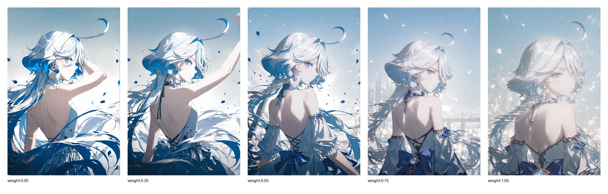
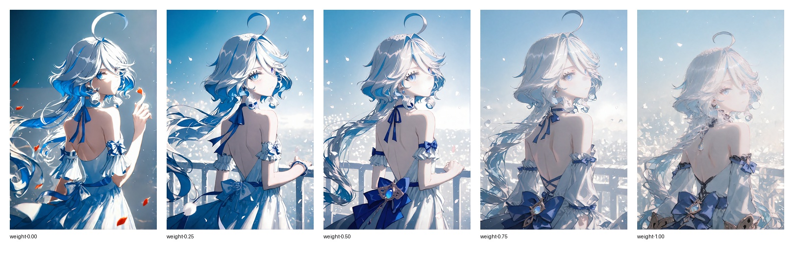
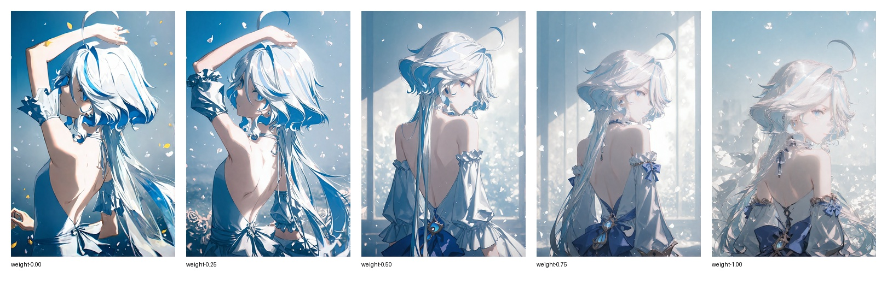
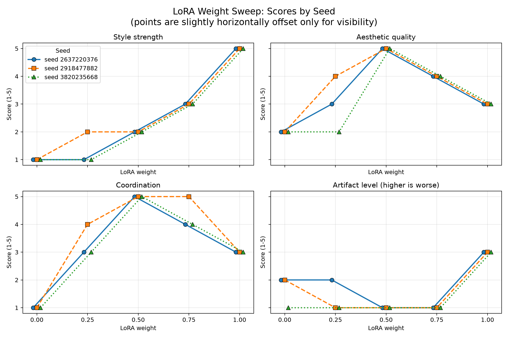
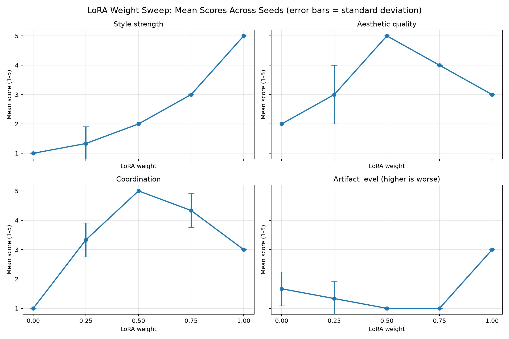

# Experiment 001: LoRA Weight Sweep

## Question

鍦ㄥ浐瀹?checkpoint銆乸rompt銆乻eed 鍜岄噰鏍峰弬鏁版椂锛?
LoRA 鏉冮噸鐨勫彉鍖栦細鎬庢牱褰卞搷鐢熸垚缁撴灉锛?

鎴戜富瑕佽瀵燂細

- 椋庢牸琛ㄧ幇
- 浜虹墿缁撴瀯
- 鍥惧儚缁嗚妭
- 浼奖鎴栬繃鎷熷悎鐥曡抗

鎴戣€冭檻鐨勭洰鏍噇ora鏄竴涓瀬瀵岀洓鍚嶇殑浼犲lora鈥斺€擟unnyFunky

鎴戝皢瀹為獙璇ora鍦ㄤ竴寮犵壒瀹氬浘閲屾潈閲嶄笉鍚屽鑷寸殑鍙樺寲

鍥犳璇ュ疄楠屽疄鐢ㄦ剰涔夊苟涓嶉珮锛屼粎浣滅粌涔?

## Hypothesis

鎴戝悎鐞嗛娴嬶細

- 杈冧綆鏉冮噸鏃讹紝LoRA 椋庢牸涓嶆槑鏄撅紱
- 涓瓑鏉冮噸鍙兘鍦ㄩ鏍间笌缁撴瀯涔嬮棿鏇村钩琛★紱
- 杈冮珮鏉冮噸鍙兘澧炲己椋庢牸锛屼篃鍙兘甯︽潵缁撴瀯寮傚父鎴栫粏鑺傜矘杩炪€?

## Controlled Variables

- Checkpoint: chenkinNoobXLCKXL_v02
- 鍥哄畾LoRA:
  - < lora:棣ㄦ煋_Wan21-14B-720P:0.5 >
  - < lora:骞绘湀閲嶅厜_鏆栬壊婊ら暅_0.1:0.5 >
  - < lora:韪忕悍:0.6 >
  - < lora:20250514-1747231472827:0.4 >
  - < lora:VOGUE_Fashion_Magazine_Cover_Vintage_1960-1975_SDXL:2 >
  - tips锛氶儴鍒唋ora鐨刼utput name瀹炲湪濂囨€紝鎯冲鐜板彲浠ョ敤hash绮惧噯瀵绘壘
- 寰呮祴LORA:
  - < lora:CunnyFunkyXLillokrV6311P >
- Prompt: 
  - ```textile
    (vogue:2),1girl,solo,long hair,looking at viewer,bangs,blue eyes,hair ornament,dress,bare shoulders,jewelry,blue hair,upper body,ahoge,white hair,multicolored hair,earrings,detached sleeves,looking back,from behind,white dress,arm up,streaked hair,petals,veil,backless outfit,backless dress,Furina,depth of field,light particles,lens flare,(artist:quasarcake:0.6),extreme aesthetic,(wlop:0.6),wanke,rella,wanke,masterpiece,best quality,good quality,newest,year 2024,year 2023,very aesthetic,absurdres,Visual impact,A shot with tension,ultra-high resolution,32K UHD,sharp focus,best quality,masterpiece,Emotionalization masterpiece,unconventional supreme,masterful details,with a high end texture,in the style of fashion photography,(Visual impact:1.2),giving the poster a dynamic and visually striking appearance,impactful picture,offcial art,colorful,splash of color,movie perspective,masterpiece,best quality,amazing quality,very aesthetic,absurdres,best quality,newest
    ```
- Negative prompt: 
  - ```textile
    multiple_breasts,(mutated_hands_and_fingers:1.5_),(long_body_:1.3),(mutation,poorly_drawn_:1.2)_,black white,bad_anatomy,liquid_body,liquid_tongue,disfigured,malformed,mutated,anatomical_nonsense,text_font_ui,error,malformed_hands,long_neck,blurred,lowers,lowres,bad_anatomy,bad_proportions,bad_shadow,uncoordinated_body,unnatural_body,fused_breasts,bad_breasts,huge_breasts,poorly_drawn_breasts,extra_breasts,liquid_breasts,heavy_breasts,missing_breasts,huge_haunch,huge_thighs,huge_calf,bad_hands,fused_hand,missing_hand,disappearing_arms,disappearing_thigh,disappearing_calf,disappearing_legs,fused_ears,bad_ears,poorly_drawn_ears,extra_ears,liquid_ears,heavy_ears,missing_ears,fused_animal_ears,bad_animal_ears,poorly_drawn_animal_ears,extra_animal_ears,liquid_animal_ears,heavy_animal_ears,missing_animal_ears,text,ui,error,missing_fingers,missing_limb,fused_fingers,one_hand_with_more_than_5_fingers,one_hand_with_less_than_5_fingers,one_hand_with_more_than_5_digit,one_hand_with_less_than_5_digit,extra_digit,fewer_digits,fused_digit,missing_digit,bad_digit,liquid_digit,colorful_tongue,black_tongue,cropped,watermark,username,blurry,JPEG_artifacts,signature,3D,3D_game,3D_game_scene,3D_character,malformed_feet,extra_feet,bad_feet,poorly_drawn_feet,fused_feet,missing_feet,extra_shoes,bad_shoes,fused_shoes,more_than_two_shoes,poorly_drawn_shoes,bad_gloves,poorly_drawn_gloves,fused_gloves,bad_cum,poorly_drawn_cum,fused_cum,bad_hairs,poorly_drawn_hairs,fused_hairs,big_muscles,ugly,bad_face,fused_face,poorly_drawn_face,cloned_face,big_face,long_face,bad_eyes,fused_eyes_poorly_drawn_eyes,extra_eyes,malformed_limbs,more_than_2_nipples,missing_nipples,different_nipples,fused_nipples,bad_nipples,poorly_drawn_nipples,black_nipples,colorful_nipples,gross_proportions._short_arm,(((missing_arms))),missing_thighs,missing_calf,missing_legs,mutation,duplicate,morbid,mutilated,poorly_drawn_hands,more_than_1_left_hand,more_than_1_right_hand,deformed,(blurry),disfigured,missing_legs,extra_arms,extra_thighs,more_than_2_thighs,extra_calf,fused_calf,extra_legs,bad_knee,extra_knee,more_than_2_legs,bad_tails,bad_mouth,fused_mouth,poorly_drawn_mouth,bad_tongue,tongue_within_mouth,too_long_tongue,black_tongue,big_mouth,cracked_mouth,bad_mouth,dirty_face,dirty_teeth,dirty_pantie,fused_pantie,poorly_drawn_pantie,fused_cloth,poorly_drawn_cloth,bad_pantie,yellow_teeth,thick_lips,bad_cameltoe,colorful_cameltoe,bad_asshole,poorly_drawn_asshole,fused_asshole,missing_asshole,bad_anus,bad_pussy,bad_crotch,bad_crotch_seam,fused_anus,fused_pussy,fused_anus,fused_crotch,poorly_drawn_crotch,fused_seam,poorly_drawn_anus,poorly_drawn_pussy,poorly_drawn_crotch,poorly_drawn_crotch_seam,bad_thigh_gap,missing_thigh_gap,fused_thigh_gap,liquid_thigh_gap,poorly_drawn_thigh_gap,poorly_drawn_anus,bad_collarbone,fused_collarbone,missing_collarbone,liquid_collarbone,strong_girl,obesity,worst_quality,low_quality,normal_quality,liquid_tentacles,bad_tentacles,poorly_drawn_tentacles,split_tentacles,fused_tentacles,missing_clit,bad_clit,fused_clit,colorful_clit,black_clit,liquid_clit,QR_code,bar_code,censored,safety_panties,safety_knickers,beard,furry_,pony,pubic_hair,mosaic,excrement,faeces,shit,futa,testiss,
    ```
- Seed: 3820235668
- Sampler: DPM++ 2M Karras
- Steps: 35
- CFG: 7.0
- Resolution: 600x900
- Hires Module 1: Use same choices
- Hires CFG Scale: 5
- Hires upscale: 2
- Hires steps: 20
- Hires upscaler: R-ESRGAN 4x+ Anime6B
- Base resolution: 600 x 900
- Final output resolution: approximately: 1200 x 1800

### Hires. fix

- Enabled: Yes
- Detailed Hires. fix settings are embedded in the original PNG metadata and will be held constant for the additional seed sweeps.

## Independent Variable

LoRA weight:

- 0.00
- 0.25
- 0.50
- 0.75
- 1.00

## Results

### Initial Seed Overview

The original single-seed result is retained as one of the three observations:



The multi-seed charts and all three seed overviews are provided in the [Multi-seed Results](#multi-seed-results) section below.

### Weight 0.00


### Weight 0.25


### Weight 0.50


### Weight 0.75


### Weight 1.00


## Scoring Method

Each image was scored by one evaluator (myself) on a 1鈥? scale.

- **Style strength**: how clearly the tested LoRA's target visual features appear.
- **Aesthetic quality**: my personal judgment of the image's overall visual appeal.
- **Coordination**: how naturally the tested LoRA works with the checkpoint, fixed LoRAs, and prompt.
- **Artifact level**: visible artifacts or structural problems; higher means worse.

The scores are subjective annotations for organizing my observations.
They are not objective quality metrics and should not be interpreted as statistical evidence.

## Observations

- Weight 0.00锛氬嚑涔庢病鏈夎瀵熷埌鐩爣 LoRA 鐨勯鏍肩壒寰侊紱鐢变簬鏈疄楠岄鍏堣璁¤lora涓烘牳蹇冪敾椋庢潈閲嶏紝鍥犳缂哄け璇ora涔嬪悗鍥剧墖璐ㄦ劅杈冨樊锛屽厜鏁堢瓑閮介潪甯哥矖绯欍€?
- Weight 0.25锛氬紑濮嬪嚭鐜颁竴浜涚洰鏍囬鏍肩殑璐ㄦ劅锛屼絾鏄敱浜庢潈閲嶈緝浣庯紝鍏夋晥涓嶈冻锛岀敾椋庤川鎰熶緷鏃у崟钖勭矖绯欍€?
- Weight 0.50锛氱洰鏍囬鏍艰緝鏄庢樉锛屼篃寰堝ソ鐨勪笌鍏朵粬lora鐩搁厤鍚堬紝缇庢劅寰楀埌璐ㄥ彉銆傚厜鏁堜笌鐏板害姣斾緥鍜岃皭锛岀浉寰楃泭褰帮紝鏄湪涓嬫渶鍠滄鐨勪竴寮?
- Weight 0.75锛歝unnyfunky鐨勭嫭鐗圭敾椋庡紑濮嬪嚫鏄撅紝鍏夋晥娑︽辰绋嶅井婧㈠嚭锛屼竴瀹氱▼搴︿笂瑕嗙洊浜嗗叾浠杔ora锛屼絾鐢变簬cf鐨勫簳瀛愮‘瀹炰笉閿欙紝鎵€浠ョ編鎰熻繕琛屻€?
- Weight 1.00锛歝f鐨勯鏍煎交搴曠垎鍙戯紝闂棯浜寒鐨勭伆娑︽劅鏋佸叾鍑稿嚭锛屼絾鍜屽叾浠杔ora鐨勯厤鍚堜骇鐢熶簡涓€浜涘け璋愩€?

杩欏彧鏄竴涓浐瀹?seed 涓嬬殑瑙傚療锛屼笉瓒充互璇存槑鏌愪釜鏉冮噸鏅亶鏈€浼樸€?

## Output Stage

鎵€鏈夊浘鐗囧潎鍦ㄧ浉鍚岀殑 Hires.fix 娴佺▼鍚庤繘琛岃瘎浠枫€傚洜姝わ紝鏈疄楠岃瘎鍒嗘弿杩扮殑鏄渶缁堣緭鍑哄浘鍍忥紝鑰屼笉鏄粎鎻忚堪鍩虹鍒嗚鲸鐜囩敓鎴愰樁娈电殑缁撴灉銆?

## Limitations

- 璇ュ疄楠屽浐瀹氫簡涓€涓?checkpoint銆佷竴涓?prompt銆佷竴涓?seed锛屼互鍙婅嫢骞插浐瀹?LoRA锛涚粨鏋滃彧鎻忚堪杩欎竴鍏蜂綋缁勫悎涓嬬殑鐜拌薄銆?
- 鍙娇鐢ㄤ簡涓€涓?seed锛屾棤娉曟帓闄ら殢鏈哄垵濮嬪櫔澹伴€犳垚鐨勫伓鐒跺樊寮傘€?
- 椋庢牸寮哄害銆佺編鎰熴€佺粨鏋勮川閲忓拰 LoRA 闂村崗璋冩€х洰鍓嶇敱鍗曚汉涓昏鍒ゆ柇锛屽皻鏈缓绔嬮噺鍖栬瘎鍒嗘爣鍑嗐€?
- 娴嬭瘯 LoRA 涓庡叾浠栧浐瀹?LoRA 鍙兘瀛樺湪鐩镐簰浣滅敤锛屽洜姝や笉鑳藉皢瑙傚療鍒扮殑鍙樺寲瀹屽叏瑙ｉ噴涓烘祴璇?LoRA 鐨勫绔嬪睘鎬с€?
- 杩欎簺鍒嗘暟鍧囦粎鐢辨垜鑷繁涓昏璇勫嚭锛屼粎浠ｈ〃涓汉瀹＄編
- 璇勫垎缁村害浠呭睘浜庢湁搴忓瀷涓昏鏍囨敞锛屽苟涓嶄唬琛ㄥ瓨鍦ㄥ浐瀹氶噺鍖栧樊璺?
- 鏈疄楠岃瘎鍒嗕笌瑙嗚瑙傚療鍧囧熀浜庢渶缁堢殑 Hires.fix 杈撳嚭鍥撅紝鑰屼笉鏄師濮嬬殑 600 x 900 鍩虹鐢熸垚鍥俱€傚洜姝わ紝瑙傚療鍒扮殑宸紓鍙兘鍚屾椂鍙嶆槧娴嬭瘯 LoRA 鏉冮噸涓庡浐瀹?Hires.fix 娴佺▼涔嬮棿鐨勭浉浜掍綔鐢紝鍖呮嫭浜屾閲囨牱鍙傛暟鍜?R-ESRGAN 瓒呭垎妯″瀷鐨勫奖鍝嶃€?

## Next Step

浣跨敤鑷冲皯 3 涓笉鍚?seed 閲嶅杩欑粍 LoRA 鏉冮噸瀹為獙锛?
瑙傚療鈥滀腑绛夋潈閲嶆洿骞宠　鈥濊繖涓€鐜拌薄鏄惁绋冲畾銆?

鍚庣画鍙互灏濊瘯涓烘瘡寮犲浘璁板綍锛?

- 椋庢牸寮哄害璇勫垎
- 浜虹墿缁撴瀯璇勫垎
- 浼奖绋嬪害璇勫垎

## Record Update

Hires.fix 鍙傛暟鏈€鍒濇湭琚褰曪紱鍦ㄦ墿灞曡嚦澶?seed 瀹為獙鍓嶅凡琛ュ叏銆傛渶鍒濈殑浜斿紶鍥惧潎浣跨敤浜嗕笂鏂囧垪鍑虹殑 Hires.fix 璁剧疆銆?
## Multi-seed Results

### Seed 3820235668 Overview


### Seed 2918477882 Overview



### Seed 2637220376 Overview



### Subjective Score Curves by Seed



为避免不同 seed 在相同评分处完全重叠，按 seed 展示的曲线图对横坐标加入了极小的视觉偏移。该偏移只用于区分数据点；所有点对应的真实 LoRA 权重仍以 `scores.csv` 中记录的离散取值为准。

### Mean Subjective Scores Across Seeds



## Multi-seed Observations

涓変釜 seed 涓紝娴嬭瘯 LoRA 鐨勯鏍煎己搴﹂兘闅忔潈閲嶅鍔犺€屾彁楂橈紱鍏朵腑 1.00 鍦ㄤ笁缁勪腑閮借〃鐜板嚭鏄庢樉鐨勯鏍艰鐩栦笌杈冧綆鐨勫崗璋冩€с€傜浉杈冧箣涓嬶紝缇庢劅涓庡崗璋冩€у湪涓瓑鏉冮噸闄勮繎杈冮珮锛屼絾鍏舵渶浼樼偣骞朵笉瀹屽叏涓€鑷达細seed 3820235668 涓?2637220376 涓?0.50 鐨勭患鍚堣瘎鍒嗘渶楂橈紝鑰?seed 2918477882 涓?0.50 涓?0.75 鐨勫崗璋冩€у悓涓烘渶楂橈紝0.25 宸叉樉绀哄嚭杈冩槑鏄剧殑缇庢劅鎻愬崌銆?
鍥犳锛屽湪褰撳墠涓夌粍 seed 涓嬶紝鏇寸ǔ瀹氱殑瑙傚療鏄€滄彁楂樻潈閲嶄細澧炲己 CunnyFunky 鐨勫彲瑙侀鏍肩壒寰佲€濓紱鑰屸€滄煇涓€涓浐瀹氭潈閲嶅缁堟渶缇庤鎴栨渶鍗忚皟鈥濆苟涓嶅簲琚涓?LoRA 鐨勬櫘閬嶅睘鎬с€傚叿浣撴瀯鍥俱€佷汉鐗╁Э鎬佸拰鑳屾櫙鏉′欢閮戒細鏀瑰彉 LoRA 涓?checkpoint銆佸浐瀹?LoRA 鍜?prompt 鐨勭浉浜掍綔鐢ㄣ€?
## Multi-seed Limitations

- 鏈疄楠屾墿灞曞埌 3 涓?seed锛岃兘澶熷垵姝ヨ瀵熺粨鏋滄槸鍚︾ǔ瀹氾紝浣嗘牱鏈粛鐒跺緢灏忥紝涓嶈兘鏀寔寮虹粺璁＄粨璁恒€?- 鎵€鏈夊浘鐗囦粛鐢辨垜涓€浜鸿瘎鍒嗭紝鍥犳缁撴灉浼氬彈鍒颁釜浜哄缇庡亸濂界殑褰卞搷銆?- 鍧囧€煎拰鏍囧噯宸彧鏄湪鎻忚堪褰撳墠 3 涓?seed 鐨勬尝鍔紝涓嶄唬琛ㄥ鎵€鏈夐殢鏈虹瀛愮殑鍙潬浼拌銆?- 鏂板 seed 鐨?Hires.fix 璁剧疆鎸夌収鏈疄楠岃褰曚繚鎸佷笉鍙橈紱鏈疄楠屼粛鎻忚堪瀹屾暣鐢熸垚涓?Hires.fix 绠＄嚎涓嬬殑鏈€缁堣緭鍑恒€?
## Updated Next Step

鍦ㄥ浐瀹?CunnyFunky 鏉冮噸鐨勬潯浠朵笅锛屾壂鎻忎竴涓緟鍔?LoRA 鐨勬潈閲嶏紝杩涗竴姝ョ爺绌跺涓?LoRA 鍚屾椂浣跨敤鏃剁殑鍗忚皟鎬т笌鐩镐簰浣滅敤銆備篃鍙互澧炲姞涓嶅悓 prompt锛屼互鍖哄垎 seed 閫犳垚鐨勬尝鍔ㄤ笌 prompt 閫犳垚鐨勬潯浠跺彉鍖栥€?